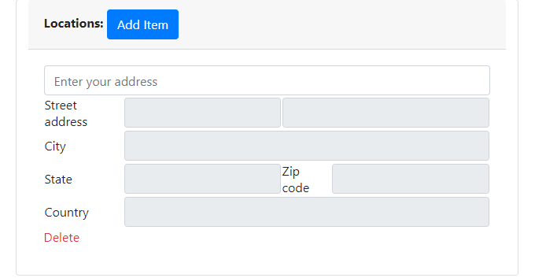

# multiple-places-autocomplete-form
This uses the Google Places Autocomplete API and fills in address fields. Users can add multiple fields dynamically.

Make sure to use your google api key in line 105 of index.html in place of YOUR_API_KEY.

